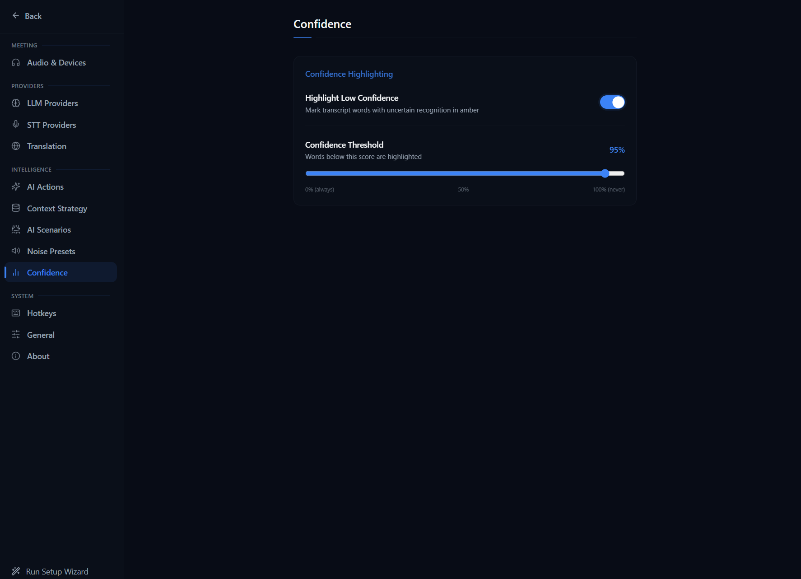
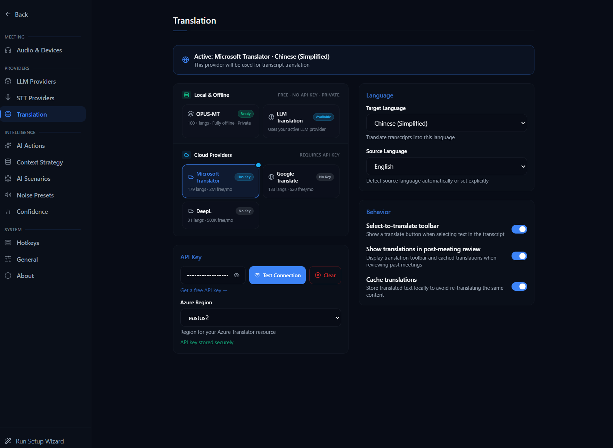

# Configuration Guide

NexQ supports multiple STT and LLM providers, configurable audio devices, and local RAG for document context. All settings are accessible via **Settings** (`Ctrl+,`).

## General Settings

The General settings panel controls app-wide behavior and preferences. Here you can configure:

- **App behavior** -- startup options, system tray behavior, and window preferences
- **Theme and appearance** -- light/dark mode and visual customization
- **Language** -- interface language selection
- **Update preferences** -- automatic update checks and notification settings
- **Data management** -- storage location and cleanup options

## Speech-to-Text (STT) Providers

NexQ uses a two-party audio model: **"You"** (microphone) and **"Them"** (system audio) each have independent STT providers, devices, and mute controls. See the [AI Providers Guide](ai-providers.md) for a detailed comparison of all STT providers and help choosing the right one.

### Web Speech API (Built-in)

- **Setup**: None -- works out of the box
- **Requires API Key**: No
- **Runs Locally**: Yes (browser engine)
- **Best For**: Quick start, low resource usage
- **Limitations**: Requires an active internet connection on some systems; accuracy varies by browser engine

### Deepgram

- **Setup**: Create an account at [deepgram.com](https://deepgram.com) and generate an API key
- **Requires API Key**: Yes
- **Runs Locally**: No (cloud)
- **Best For**: High-accuracy real-time transcription
- **Models**: nova-3 (recommended), nova-2, nova, enhanced, base
- **Configuration Options**:
  - Smart formatting, punctuation, numerals
  - Endpointing threshold (silence detection)
  - Diarization, profanity filter
  - Custom key terms

### Groq Whisper

- **Setup**: Create an account at [groq.com](https://groq.com) and generate an API key
- **Requires API Key**: Yes
- **Runs Locally**: No (cloud)
- **Best For**: Fast Whisper inference at low cost
- **Models**: whisper-large-v3, whisper-large-v3-turbo
- **Configuration Options**:
  - Language (auto-detect or specify ISO 639-1 code)
  - Temperature (0.0--1.0)
  - Batch segment duration
  - Response format, timestamp granularity

### Whisper (Local)

- **Setup**: Download a Whisper model from Settings > STT > Local Models
- **Requires API Key**: No
- **Runs Locally**: Yes
- **Best For**: Offline use, privacy-sensitive environments
- **Engines**: whisper.cpp, Sherpa-ONNX, ORT Streaming, Parakeet TDT
- **Note**: Local models require significant CPU/RAM. Smaller models (tiny, base) are faster but less accurate. Larger models (large-v3) are more accurate but slower.

### Windows Native Speech

- **Setup**: None -- uses Windows built-in speech recognition
- **Requires API Key**: No
- **Runs Locally**: Yes
- **Best For**: Offline fallback

## LLM Providers

The LLM provider powers all AI features: Assist, What to Say, Shorten, Follow-Up, Recap, Ask Question, Meeting Summary, and Action Items. See the [AI Providers Guide](ai-providers.md) for a detailed comparison of all LLM providers, including local vs cloud tradeoffs and setup instructions.

### Ollama (Local)

- **Setup**:
  1. Download and install from [ollama.ai](https://ollama.ai)
  2. Pull a model: `ollama pull llama3.2` (or `mistral`, `gemma2`, etc.)
  3. NexQ auto-detects Ollama on startup at `http://localhost:11434`
- **Requires API Key**: No
- **Runs Locally**: Yes
- **Best For**: Privacy, no usage costs, offline capability

### OpenAI

- **Setup**: Get an API key from [platform.openai.com](https://platform.openai.com)
- **Requires API Key**: Yes
- **Runs Locally**: No
- **Models**: GPT-4o, GPT-4o-mini, GPT-4-turbo, GPT-3.5-turbo, and more

### Anthropic

- **Setup**: Get an API key from [console.anthropic.com](https://console.anthropic.com)
- **Requires API Key**: Yes
- **Runs Locally**: No
- **Models**: Claude 4 Opus, Claude 4 Sonnet, Claude 3.5 Haiku, and more

### Groq

- **Setup**: Get an API key from [console.groq.com](https://console.groq.com)
- **Requires API Key**: Yes
- **Runs Locally**: No
- **Best For**: Ultra-fast inference
- **Models**: Llama 3, Mixtral, Gemma, and more

### Google Gemini

- **Setup**: Get an API key from [aistudio.google.com](https://aistudio.google.com)
- **Requires API Key**: Yes
- **Runs Locally**: No
- **Models**: Gemini 2.0 Flash, Gemini 1.5 Pro, Gemini 1.5 Flash

### LM Studio (Local)

- **Setup**:
  1. Download from [lmstudio.ai](https://lmstudio.ai)
  2. Download a model and start the local server
  3. NexQ connects to LM Studio's OpenAI-compatible API
- **Requires API Key**: No
- **Runs Locally**: Yes

### OpenRouter

- **Setup**: Get an API key from [openrouter.ai](https://openrouter.ai)
- **Requires API Key**: Yes
- **Runs Locally**: No
- **Best For**: Access to hundreds of models from multiple providers through a single API
- **Features**: Model catalog with pricing, context length, and capability info

## API Key Management

All API keys are stored securely in **Windows Credential Manager** (not in config files or plain text). NexQ uses the Windows `CredentialManager` API to:

- Store keys: `Settings > [Provider] > API Key > Save`
- Test keys: `Settings > [Provider] > Test Connection`
- Delete keys: `Settings > [Provider] > Remove API Key`

Keys are scoped to your Windows user account and persist across app updates.

## Audio Device Configuration

See the [Audio Setup Guide](audio-setup.md) for a comprehensive guide to audio configuration, including device selection, WASAPI loopback details, and troubleshooting common audio issues.

### Microphone ("You")

Select the input device used for capturing your voice. The device picker shows all available input devices with a live audio level meter for verification.

### System Audio ("Them")

Select the output device used to capture remote participants' audio via Windows loopback (WASAPI). This captures whatever audio is playing through that device -- perfect for Zoom, Teams, Google Meet, or any conferencing app.

### Audio Testing

Use the **Test** button next to each device to verify audio levels before starting a meeting. The live peak meter shows real-time audio levels from the selected device.

### Recording

Enable **Recording** to save meeting audio as WAV files alongside the transcript. Recordings are stored in the app data directory and can be played back from the meeting history.

## Context Intelligence (RAG)

NexQ supports loading documents (PDF, TXT, MD, DOCX) as context for AI responses. When RAG is enabled, the AI uses relevant document chunks to provide more informed answers. See [Using Context Intelligence (RAG)](rag-context.md) for a complete guide to loading documents, best practices by use case, and optimization tips.

### Setup

1. Open Settings > Context
2. Load documents using the file picker
3. Enable RAG and configure the embedding model (requires Ollama with an embedding model like `nomic-embed-text`)
4. Documents are automatically chunked, embedded, and indexed

### Configuration

- **Chunk size and overlap**: Control how documents are split
- **Top-K results**: Number of relevant chunks included in AI context
- **Similarity threshold**: Minimum relevance score for chunk inclusion
- **Search mode**: Semantic, keyword (FTS), or hybrid search

## AI Actions

The AI Actions panel configures how NexQ's AI assistance behaves during meetings. Key options include:

- **Action types** -- enable or disable specific AI modes (Assist, What to Say, Shorten, Follow-Up, Recap, Ask Question)
- **Auto-trigger settings** -- configure whether AI suggestions appear automatically based on conversation flow, or only when manually triggered
- **Response style** -- adjust the tone, length, and format of AI responses
- **Context window** -- control how much conversation history is sent to the LLM with each request

## AI Scenarios

AI Scenarios let you switch between pre-configured prompt profiles optimized for different use cases. Each scenario tunes the AI's behavior, tone, and focus:

- **Interview** -- focuses on answer framing, follow-up suggestions, and conversational guidance tailored to job interviews
- **Lecture** -- emphasizes summarization, key concept extraction, and study-relevant assistance
- **Meeting** -- provides general meeting assistance with action items, decisions tracking, and discussion summaries
- **Custom** -- create your own scenario with custom system prompts and behavior settings

Select a scenario in Settings before starting a meeting to get the most relevant AI assistance.

## Confidence Display

The Confidence settings control how NexQ displays transcription confidence indicators. Configure:

- **Confidence threshold** -- set the minimum confidence level for displaying transcribed text
- **Visual indicators** -- toggle color-coded confidence highlighting on transcript segments
- **Low-confidence handling** -- choose how to display uncertain transcriptions (dim, strikethrough, or hide)

Higher confidence thresholds filter out uncertain transcriptions, giving you a cleaner transcript at the cost of potentially missing some words.

## Hotkeys

The Hotkey settings let you customize keyboard shortcuts for NexQ's core actions. Configure:

- **Global shortcuts** -- system-wide shortcuts that work even when NexQ is not focused (e.g., start/stop meeting, toggle overlay)
- **Meeting shortcuts** -- shortcuts active during meetings for AI actions
- **Custom key bindings** -- remap any action to your preferred key combination

See [Keyboard Shortcuts](keyboard-shortcuts.md) for a full reference of all available shortcuts and their default bindings.

## Noise Preset

Noise Preset settings help optimize audio quality for transcription accuracy. Configure:

- **Noise reduction level** -- adjust the aggressiveness of background noise suppression
- **Environment presets** -- select from pre-configured profiles for common environments (quiet room, office, cafe, outdoors)
- **Voice activity detection (VAD)** -- tune sensitivity for detecting when someone is speaking vs. silence
- **Audio enhancement** -- enable or disable audio processing filters that improve STT accuracy

Choose the preset that matches your typical meeting environment for the best transcription results.

## Translation

The Translation settings configure real-time translation of meeting transcripts. Key options include:

- **Target language** -- select the language you want transcripts translated into
- **Source language** -- set the expected language of speakers, or use auto-detect
- **Translation provider** -- choose the translation engine (uses the configured LLM provider)
- **Display mode** -- show translations inline alongside the original text, or replace the original text entirely

Translation works in real-time during meetings, providing translated text alongside or in place of the original transcription.
