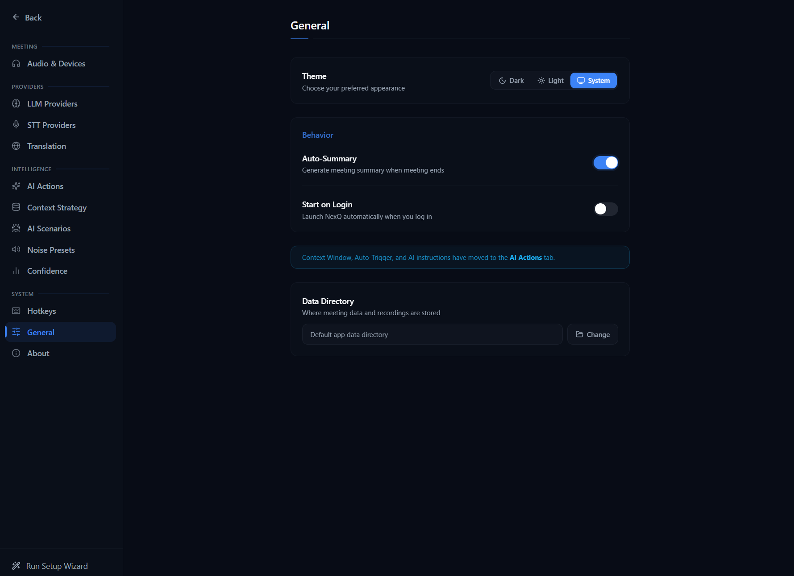

# Getting Started with NexQ

NexQ is an AI Meeting Assistant and Real-Time Interview Copilot for Windows. It runs as a desktop application with real-time transcription, AI-powered assistance, and an always-on-top overlay you can use during meetings.

## System Requirements

- Windows 10 or Windows 11
- 8 GB RAM minimum (16 GB recommended for local STT/LLM)
- Microphone for voice capture
- Internet connection (for cloud STT/LLM providers) or local models installed

## Installation

### 1. Download the Installer

Download the latest `.exe` installer from the [GitHub Releases](https://github.com/VahidAlizadeh/NexQ/releases) page. The file is named `NexQ_x.x.x_x64-setup.exe`.

### 2. Run the Installer

Double-click the downloaded `.exe` file. You may see a Windows SmartScreen warning since the app is not yet code-signed.

**If Windows SmartScreen appears:**

1. Click **"More info"** (the text link, not the button)
2. Click **"Run anyway"**

The installer uses NSIS and installs per-user (no admin rights required). The default location is `%LOCALAPPDATA%\NexQ`.

### 3. First Launch

After installation, NexQ starts automatically. You will see:

- **Launcher window** (900x650) -- the main dashboard for managing meetings, settings, and history
- **System tray icon** -- NexQ lives in your taskbar tray; closing the window hides it to tray rather than quitting

## Quick Setup

Open Settings (click the gear icon or press `Ctrl+,`) to access all configuration options. The General settings panel is shown above.

### Configure a Speech-to-Text Provider

NexQ needs an STT provider to transcribe audio. The fastest way to get started:

**Option A: Web Speech API (zero setup)**

1. Open Settings (click the gear icon or press `Ctrl+,`)
2. Under **Speech-to-Text**, select **Web Speech API** for both "You" (mic) and "Them" (system audio)
3. No API key needed -- this uses the browser's built-in speech recognition

**Option B: Deepgram or Groq (cloud, high accuracy)**

1. Open Settings > Speech-to-Text
2. Select **Deepgram** or **Groq**
3. Enter your API key (get one from [deepgram.com](https://deepgram.com) or [groq.com](https://groq.com))
4. Click **Test Connection** to verify

### Configure an LLM Provider

NexQ uses an LLM to generate AI assistance during meetings. The easiest local option:

**Option A: Ollama (local, free, private)**

1. Install [Ollama](https://ollama.ai) on your machine
2. Pull a model: `ollama pull llama3.2` (or any model you prefer)
3. NexQ auto-detects Ollama on startup -- no configuration needed
4. Open Settings > LLM to verify the connection and select your model

**Option B: OpenAI, Anthropic, or Groq (cloud)**

1. Open Settings > LLM
2. Select your provider
3. Enter your API key
4. Select a model from the dropdown
5. Click **Test Connection** to verify

## Start Your First Meeting

1. **Select audio devices** -- In the launcher, choose your microphone (for "You") and system audio output (for "Them" / remote participants)
2. **Press Start Meeting** or use the keyboard shortcut `Ctrl+M`
3. The **overlay window** appears (always-on-top, 500x700) showing:
   - Live transcript with speaker labels (You / Them)
   - AI assist panel with contextual suggestions
4. **Press Space** during the meeting to trigger AI Assist on the current conversation
5. **Press Ctrl+M** again to end the meeting

The meeting is saved automatically with full transcript, AI interactions, and summary.

## Next Steps

- [Interview Copilot Guide](interview-copilot.md) -- Use NexQ as your real-time interview assistant
- [Lecture Assistant Guide](lecture-assistant.md) -- Transcribe and study from lectures
- [Audio Setup Guide](audio-setup.md) -- Detailed audio device configuration and troubleshooting
- [AI Providers Guide](ai-providers.md) -- Compare all STT and LLM providers to find the best fit
- [Using Context Intelligence (RAG)](rag-context.md) -- Load documents for AI-enhanced responses
- [Configuration Guide](configuration.md) -- Full provider setup and configuration options
- [Keyboard Shortcuts](keyboard-shortcuts.md) -- Full shortcuts reference
- [Troubleshooting](troubleshooting.md) -- Common issues and solutions
