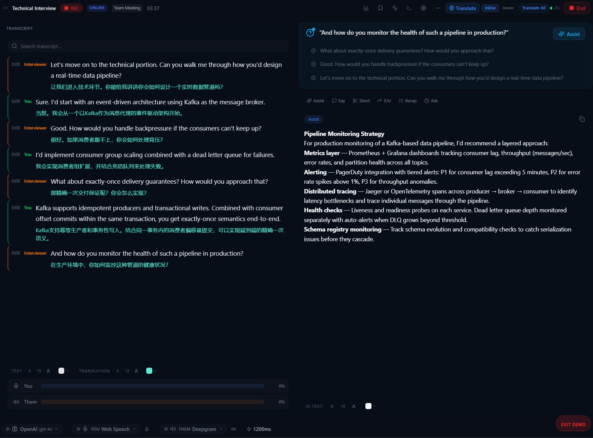

# How to Use NexQ as Your Interview Copilot

NexQ can act as your real-time interview copilot -- transcribing both sides of the conversation, surfacing AI-powered suggestions, and referencing your resume or job description on the fly.

## Prerequisites

- NexQ installed and running ([Getting Started](getting-started.md))
- An STT provider configured ([AI Providers Guide](ai-providers.md))
- An LLM provider configured ([AI Providers Guide](ai-providers.md))
- Headphones (required to prevent echo)

## Setting Up for an Interview

### 1. Choose Your STT Provider

Open Settings (`Ctrl+,`) > Speech-to-Text and configure providers for both channels:

- **Web Speech API** -- zero setup, free, good for English. Best for getting started quickly.
- **Deepgram** -- higher accuracy, real-time streaming. Requires an API key from [deepgram.com](https://deepgram.com).
- **Groq** -- very fast, free tier available. Requires an API key from [groq.com](https://groq.com).

Set the "You" channel (mic) and the "Them" channel (system audio) independently. For interviews, using the same provider for both channels works well.

### 2. Choose Your LLM Provider

Open Settings > LLM and configure one of these:

- **Ollama with llama3.2** -- local, private, free. Your conversation data never leaves your machine. Best for privacy-sensitive interviews.
- **OpenAI GPT-4o** -- cloud, highest quality suggestions. Best when you want the most accurate and nuanced AI assistance.

### 3. Select the Interview Scenario

In NexQ Settings, select the **Interview** scenario. This configures the AI prompts to focus on interview-specific assistance: follow-up suggestions, answer framing, and conversational guidance.

### 4. Load Your Resume and Job Description

Use Context Intelligence (RAG) to give the AI background about you and the role:

1. Open the **Context Intelligence** panel in the Launcher
2. Click **Add Document**
3. Select your resume PDF, the job description, and any company research notes
4. Wait for indexing to complete (progress is shown in real-time)
5. The AI now has context about your background and the role you are interviewing for

See [Using Context Intelligence (RAG)](rag-context.md) for more details on document loading.

## Positioning the Overlay

When the meeting starts, the overlay window (500x700, always-on-top, transparent) appears. Position it carefully:

- Place it **near your webcam** but slightly to the side, so glancing at it looks natural
- Resize it to a comfortable reading size -- you should be able to read suggestions without squinting
- The overlay is transparent -- **only you can see it**. It will not appear in screen shares
- Use `Ctrl+B` to toggle between the launcher and overlay windows

## During the Interview

1. **Start the meeting** with `Ctrl+M` before the interview begins
2. NexQ transcribes both sides in real-time -- your mic captures your voice, and system audio captures the interviewer
3. **AI suggestions appear automatically** as the conversation flows. The AI analyzes the dialogue and provides contextual help
4. Press **Space** to manually trigger AI Assist at any moment for an instant analysis of the current conversation
5. Use the number keys for specific AI modes:
   - `1` -- What to Say (suggests your next response)
   - `2` -- Shorten (condenses the discussion)
   - `3` -- Follow-Up (generates follow-up questions)
   - `4` -- Recap (summarizes the conversation so far)
   - `5` -- Ask Question (free-form query)

**Important**: Do not stare at the overlay. Glance at it naturally, the way you would glance at notes. Maintain eye contact with your camera.

## After the Interview

1. Press `Ctrl+M` to end the meeting
2. **Review the full transcript** in the Launcher -- every word from both sides is saved
3. Check the **AI Call Log** sidebar for all AI suggestions that were generated during the session
4. **Export or copy** the transcript for your notes or follow-up preparation
5. The meeting summary includes key discussion points, questions asked, and action items

## Tips

- **Do a dry run first.** Test your full setup (audio, STT, LLM, overlay position) before the real interview. Run a mock session with a friend or a YouTube video.
- **Mute desktop notifications.** Turn on Windows Focus Assist or Do Not Disturb mode to prevent popups during the interview.
- **Use headphones.** This is not optional -- speakers cause echo that feeds your voice back into the "Them" channel, confusing transcription.
- **Load focused documents.** A 2-page resume and a 1-page job description work better than dumping 50 pages of content. Smaller, relevant documents produce better AI context.
- **Test your audio devices.** Use the Test button in Settings > Audio to verify both mic and system audio are working before the interview starts.

## Next Steps

- [Audio Setup Guide](audio-setup.md) -- Detailed audio device configuration
- [AI Providers Guide](ai-providers.md) -- Compare all STT and LLM providers
- [Using Context Intelligence (RAG)](rag-context.md) -- Advanced document loading
- [Keyboard Shortcuts](keyboard-shortcuts.md) -- Full shortcut reference
