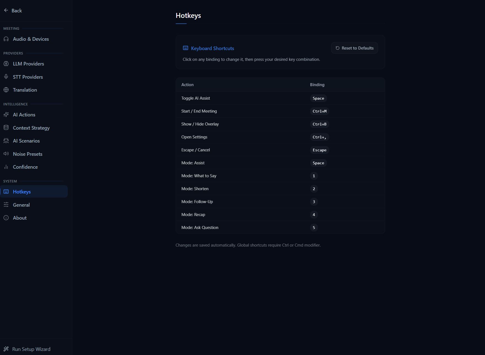

# Keyboard Shortcuts

NexQ has two levels of keyboard shortcuts: **global shortcuts** that work even when the app is not focused, and **meeting shortcuts** that work during an active meeting when the NexQ window is focused.

## Hotkey Configuration

You can customize all keyboard shortcuts in Settings > Hotkeys. The panel above shows the hotkey configuration interface where you can remap global and meeting shortcuts to your preferred key combinations.

## Global Shortcuts

These shortcuts are registered system-wide and work regardless of which application has focus.

| Shortcut | Action | Description |
|----------|--------|-------------|
| `Ctrl+M` | Start / End Meeting | Starts a new meeting if none is active; ends the current meeting if one is running |
| `Ctrl+B` | Toggle Overlay | Switches between the launcher (dashboard) and the overlay (meeting) window. Only works when a meeting is active |
| `Ctrl+,` | Open / Close Settings | Toggles the settings panel |

## Meeting Shortcuts

These shortcuts work when a meeting is active and the NexQ window (launcher or overlay) is focused. They do not trigger when typing in input fields, text areas, or dropdowns.

| Shortcut | Action | AI Mode |
|----------|--------|---------|
| `Space` | Generate AI Assist | Assist -- analyzes conversation and provides contextual help |
| `1` | What to Say | Suggests what you should say next based on the conversation |
| `2` | Shorten | Condenses the recent discussion into a brief summary |
| `3` | Follow-Up | Generates follow-up questions or discussion points |
| `4` | Recap | Provides a recap of the conversation so far |
| `5` | Ask Question | Opens the free-form question input for custom AI queries |

> **Note:** The number keys (`1`--`5`) work with both the main keyboard and the numpad. They only trigger when no modifier keys (Ctrl, Alt, Meta) are held.

## System Tray

NexQ lives in the Windows system tray. Interaction patterns:

| Action | Result |
|--------|--------|
| Double-click tray icon | Show / toggle the main window |
| Middle-click tray icon | Toggle microphone mute |
| Right-click tray icon | Open the context menu (start/stop meeting, settings, quick copy, recent meetings, quit) |

## Tips

- **Overlay during meetings**: Use `Ctrl+B` to bring up the always-on-top overlay while your meeting app (Zoom, Teams, etc.) is in the foreground. The overlay is transparent and stays above other windows.
- **Quick AI assist**: During a meeting, press `Space` at any time to get an instant AI analysis of the current conversation. No need to switch windows.
- **Mute sources independently**: You can mute "You" (mic) or "Them" (system audio) STT independently from the overlay controls. This pauses transcription for that source without stopping audio capture or recording.
